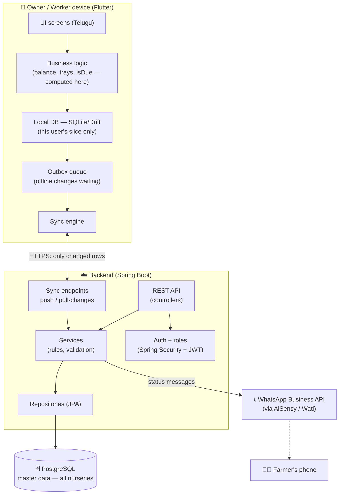
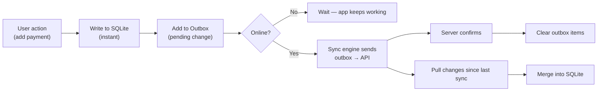
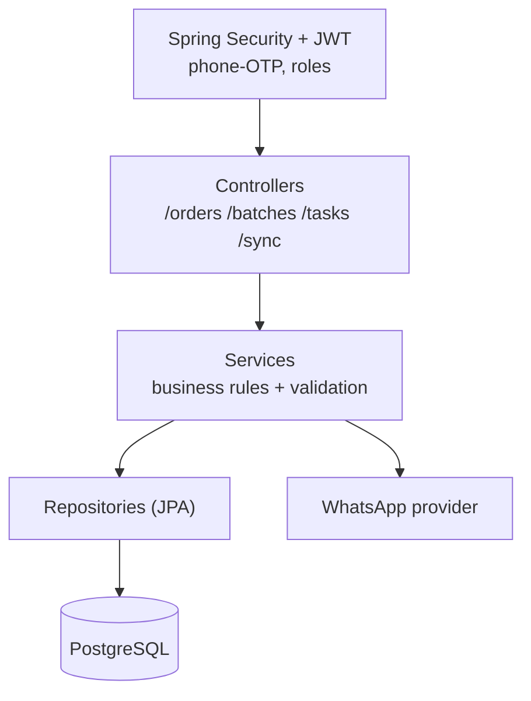
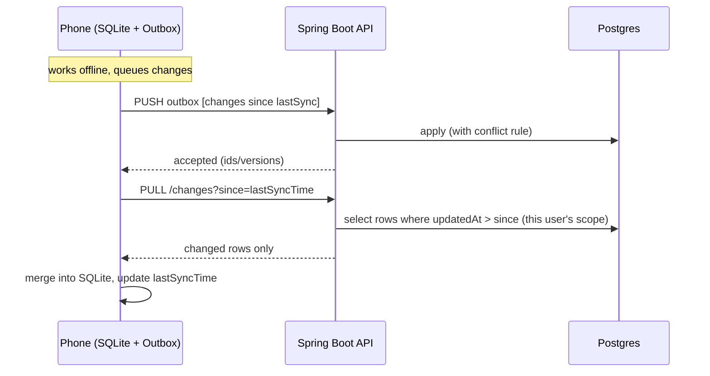
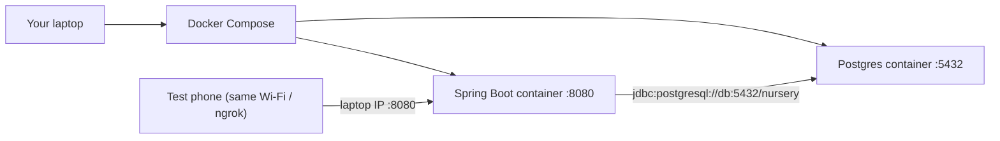

# Nursery Management App — System Architecture

A complete, offline-first architecture for the nursery app: Flutter client → local SQLite + sync → Spring Boot API → PostgreSQL, with phone-OTP auth and WhatsApp for farmer messages. This is the technical companion to the Build Spec.

---

## 1. The shape in one picture



**The one-sentence version:** each phone works fully offline against its own small SQLite copy; a sync engine exchanges only *changed rows* with the Spring Boot API over HTTPS; the API enforces rules and permissions and persists to one central Postgres; WhatsApp carries status messages out to farmers.

---

## 2. Layers explained

### Layer 1 — Client (Flutter app)
The thing on the owner's and workers' phones. Responsibilities:
- **UI** — Telugu-first screens (the prototype is the visual reference).
- **Local business logic** — balances, tray free/used, task `isDue`, stage/daysLeft are **computed on the device from stored inputs**, never stored or synced as values.
- **Local database (SQLite via Drift/sqflite)** — holds *only this user's slice*: owner = their whole nursery; worker = mainly their tasks + attendance. The app reads/writes here **instantly, offline**.
- **Outbox queue** — every offline change is recorded as a pending item to push later.
- **Sync engine** — pushes the outbox and pulls changes when a connection is available.

The app never blocks on the network. Server is for reconciling, not for day-to-day reads/writes.

### Layer 2 — Sync (the bridge)
Not a product you install — logic you write on both sides. Moves **deltas** (changed rows since last sync), both directions, using `updatedAt` timestamps and a conflict rule. Detailed in §5.

### Layer 3 — Backend (Spring Boot)
Standard layered Spring Boot:
- **Controllers (Spring Web)** — REST endpoints, including the sync endpoints.
- **Services** — business rules and validation (server-side truth: capacity checks, dispatch caps, non-negative money, permission checks).
- **Repositories (Spring Data JPA / Hibernate)** — DB access.
- **Entities** — Java classes mapped to Postgres tables.
- **Security (Spring Security + JWT)** — phone-OTP login, owner vs worker roles enforced here (never trust the client).
- **Migrations (Flyway/Liquibase)** — versioned schema changes.

### Layer 4 — Database (PostgreSQL)
The single master copy of **all** nurseries' data. Managed Postgres (automatic backups). Tables map 1:1 to the spec's entities. Every syncable table carries `id (UUID)`, `updatedAt`, `deleted` (soft delete), and `ownerId`/`nurseryId` for scoping.

### Layer 5 — External
- **WhatsApp Business API** via a provider (AiSensy/Wati) for outbound farmer status messages (utility templates, Telugu).
- Later: farmer self-service, reports export, etc.

---

## 3. Client architecture (offline-first detail)



Key rules for the client DB:
- **UUID primary keys generated on the phone** (rows are created offline before the server sees them).
- **`updatedAt`** on every row.
- **Soft delete** (`deleted=true`) instead of removing rows — a hard delete can't be communicated to other devices.
- **Store inputs, compute the rest.** Never persist `balance`, `daysLeft`, `stage` — recompute from payments/sowDate/etc.

---

## 4. Backend architecture (Spring Boot detail)



Package sketch:
```
com.nursery
 ├─ controller/   REST endpoints (OrderController, BatchController, TaskController, SyncController…)
 ├─ service/      business logic (OrderService, TrayService, SyncService…)
 ├─ repository/   Spring Data JPA interfaces
 ├─ entity/       JPA entities (Order, Batch, Payment, Task, Worker…)
 ├─ dto/          request/response objects
 ├─ security/     JWT, auth, role checks
 └─ config/       app config
```
Server-side rules that must live here (never only on the client): capacity/over-booking block, dispatch ≤ remaining, non-negative net pay, seeded-order field locks, role permissions.

---

## 5. The sync mechanism

**Two directions, deltas only, timestamp-driven.**



- **Push:** phone sends queued offline changes → server validates + applies → confirms → phone clears outbox.
- **Pull:** phone asks "what changed since X?" → server returns only rows with `updatedAt > X` **within that user's scope** → phone merges.
- **Conflict rule:** last-write-wins (newer `updatedAt` wins) almost everywhere; **payments are append-only** (never overwrite money — add or reverse) so no payment is ever lost to a conflict.
- **Scope:** owner pulls their whole nursery; worker pulls mainly their tasks/attendance.

---

## 6. What syncs (summary)

| Data | Direction | On owner phone | On worker phone |
|---|---|---|---|
| Orders, payments, discount, write-off | both | ✔ | �’— |
| Batches, timeline, counts | both | ✔ | read (their scope) |
| Tasks, task logs | both | ✔ | ✔ (own) |
| Workers, attendance, advances, payslips | both | ✔ | own attendance only |
| Expenses | both | ✔ | — |
| Editable settings (tray total, lead times) | down mostly | ✔ | — |
| Crop list / fixed reference | ships in app | — | — |
| Computed (balance, daysLeft, stage, free trays) | **never synced** | computed | computed |

---

## 7. Auth & roles
- **Phone + OTP** login (no email — right for this audience).
- JWT issued on login; every API/sync call carries it.
- Role on the user: **owner** (full nursery) or **worker** (own tasks/attendance, no money).
- Permissions enforced **server-side**; the client also hides screens, but the server is the real gate.

---

## 8. Deployment topology

**Now — local development (free):**

App reaches DB by **service name** (`db`), not `localhost`. You reach the app at `localhost:8080`; the test phone via your laptop's LAN IP or an ngrok tunnel.

**Later — cloud (same Docker image, different host):** push the identical image to Railway / Render / Fly / Oracle free-tier; use managed Postgres (bundled, or Neon/Supabase as just-the-DB). Deployment choice is deferred and reversible — the architecture doesn't change.

---

## 9. Two concrete data-flow walkthroughs

**A) Worker completes a spray task, offline:**
1. Worker taps "పూర్తి" → app writes a task-log row (done, today) to SQLite and appends a spray event to the batch timeline locally → both go to the outbox. UI updates instantly.
2. Evening, phone gets Wi-Fi → sync pushes the two rows → server validates (is this the worker's task?) → applies to Postgres.
3. Owner's phone later pulls changes → sees the completed task + the new timeline event.

**B) Owner adds a partial payment:**
1. Owner opens order (from local SQLite), taps add payment ₹2,000 → new payment row (UUID, updatedAt) written locally + outbox. Balance **recomputed on device** (contract − payments − discount).
2. Sync pushes the payment (append-only). Server stores it; dues recompute wherever queried.
3. No conflict risk — payments are only ever added, never overwritten.

---

## 10. Cross-cutting concerns
- **Backup:** managed Postgres with automatic daily backups. Losing a nursery's data once destroys trust.
- **Security:** HTTPS everywhere; JWT; server-side validation; never put sensitive data in URLs.
- **i18n:** Telugu-first; keep strings in resource files so a language toggle is possible later.
- **Observability (later):** basic logging + error tracking so you can see failures in the field.
- **Low-end devices:** Flutter + SQLite chosen for exactly this; keep the local DB lean (per-user scope).

---

## 11. Build order (matches the Build Spec §8)
1. Spring Boot skeleton + Postgres connection + health endpoint (prove the plumbing).
2. Entities/tables (with `id`/`updatedAt`/`deleted` from the start).
3. Core loop: orders → seeding → batches → three counts.
4. Money, then tasks+calendar, then labour, then expenses/dashboard.
5. Auth + roles.
6. Offline sync last (design once the API shape is stable).
7. WhatsApp status messages.

**Design-from-day-one, even before sync:** UUID keys, `updatedAt`, soft-delete, and "store inputs not computed values." Retrofitting these later is painful; baking them in costs nothing now.
